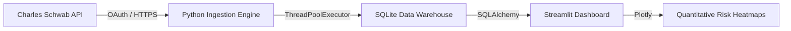

# Institutional Market Data Engine

Public documentation shell for a private institutional-grade market data ingestion pipeline.

The private implementation connects directly to the Charles Schwab Developer API via OAuth, extracting, normalizing, and storing high-frequency pricing data in a local SQLite data warehouse for quantitative risk assessment.

This repository documents the architecture, data structures, and sanitized operating model without exposing private OAuth client secrets, API tokens, or local machine configurations.

## What This Demonstrates

- **Asynchronous Extraction**: Engineered a Python extraction layer utilizing `ThreadPoolExecutor` to parallelize data retrieval across equities.
- **Relational Data Warehousing**: Eliminated rate-limited scraping in favor of structured `SQLAlchemy` inserts with strict duplicate elimination.
- **Interactive Analytics**: Built a `Streamlit` and `Plotly` frontend to generate localized momentum heatmaps and candlestick charts.
- **Privacy-First Operations**: Abstracted the executable code behind a documentation shell to protect sensitive API credentials and local deployment environments.

## Public Artifacts

- [Sanitized Code Excerpts](./examples/sanitized-code-excerpts/): Safe excerpts of the ETL pipeline (`ingestion.py`) and the Streamlit dashboard (`app.py`), showing the `ThreadPoolExecutor` and SQLite methodology with all private tokens scrubbed.

## Architecture Overview

## Public vs. Private Boundary

This public repository includes:
- Architecture summaries and diagrams.
- Sanitized code excerpts demonstrating the integration pattern.

This public repository will not include:
- `.env` files or Schwab API credentials.
- The raw `market_data.db` SQLite file containing live market extracts.
- Machine-specific pathing or absolute cron jobs.

## Current Status

This is a **Documentation Shell**. The private engine is fully functional and running locally. Future updates to this shell may include visual screenshots of the Streamlit dashboard rendering mock pricing data.
