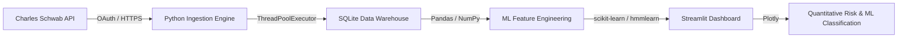

# Institutional Market Data Engine Docs

Public documentation shell for a private market data ingestion pipeline.

The private implementation uses OAuth-based market-data access, local SQLite storage, and Python analytics workflows to explore reliable pricing-data ingestion and dashboarding.

This repository documents the architecture, data structures, and sanitized operating model without exposing private OAuth client secrets, API tokens, or local machine configurations.

## What This Demonstrates

- **Parallel Extraction Pattern**: Python ingestion using `ThreadPoolExecutor` to retrieve and normalize pricing data across a watchlist.
- **Local Relational Storage**: `SQLAlchemy` inserts into SQLite with duplicate checks and repeatable table structure.
- **Analytics Dashboard Prototype**: Streamlit and Plotly views for market-data exploration, including:
  - **Price Action & SMC**: Fair Value Gaps (FVG) and Liquidity analysis (PDH/PDL).
  - **Data Science & ML Classification**: K-Means volatility clustering and Hidden Markov Model experiments for regime labeling.
  - **Alternative Data**: NLP news-sentiment experiments with NLTK VADER.
  - **Risk & Volatility**: Maximum Drawdown, Value at Risk (VaR), and Pearson Correlation Matrices.
  - **Options Analytics**: Black-Scholes pricing and implied-volatility expected-move examples.
  - **Stochastic Modeling**: Geometric Brownian Motion (GBM) and Heston-style Monte Carlo simulations.
- **Privacy-First Documentation**: Public code excerpts are sanitized examples. The live implementation, credentials, token files, databases, and local runtime state remain private.

## Public Artifacts

- [Sanitized Code Excerpts](./examples/sanitized-code-excerpts/): Safe excerpts of the ETL pipeline (`ingestion.py`) and the Streamlit dashboard (`app.py`), showing the `ThreadPoolExecutor` and SQLite methodology with all private tokens scrubbed.

## Architecture Overview

## Public vs. Private Boundary

This public repository includes:
- Architecture summaries and diagrams.
- Sanitized code excerpts demonstrating the integration pattern.

This public repository will not include:
- `.env` files or Schwab API credentials.
- The raw `market_data.db` SQLite file containing live market extracts.
- Machine-specific pathing or absolute cron jobs.

## Current Status

This is a **Documentation Shell**. It is intended to show the architecture and learning value of the private project without publishing live credentials, private data, token files, or local machine paths.

Security note: if any real credential was ever committed to this repository or its history, the credential should be rotated/revoked outside this repo and the history should be reviewed before further promotion.
